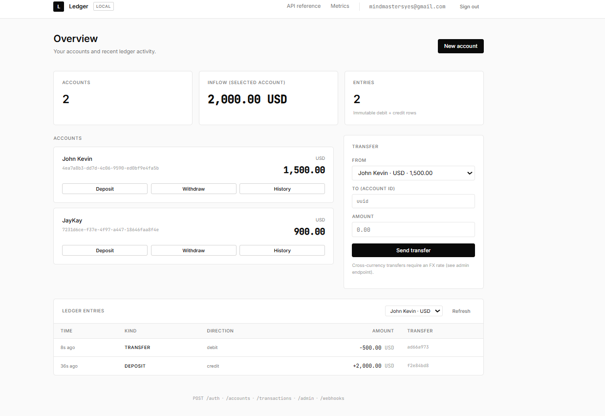
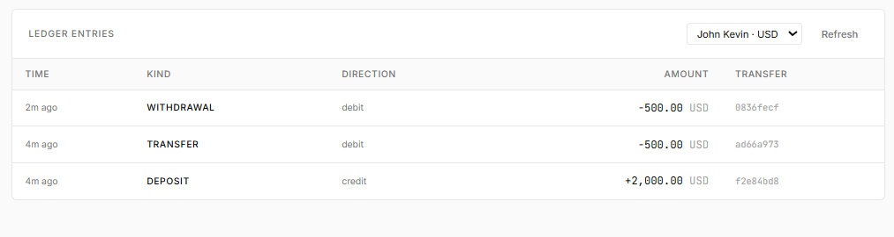
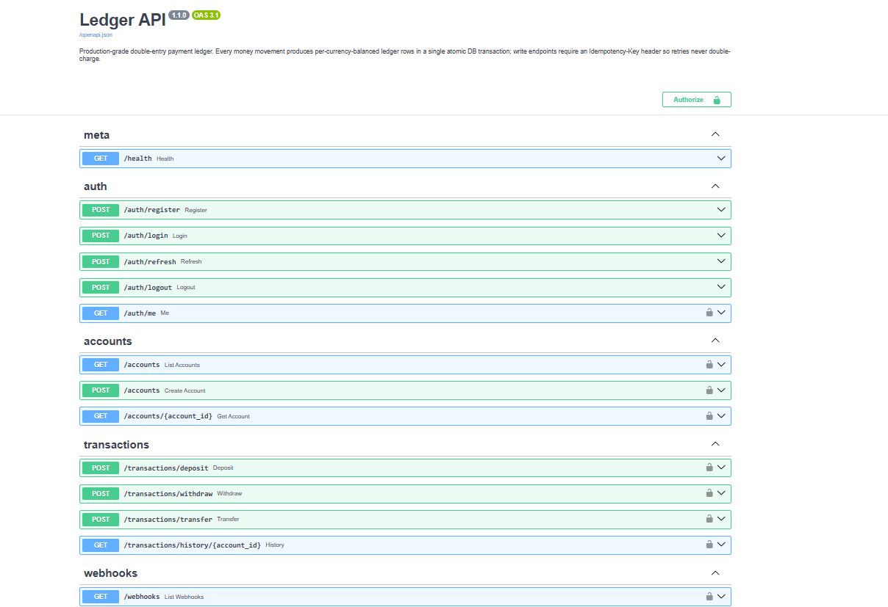

# Ledger API

A double-entry payment ledger with the correctness properties you'd want behind a real fintech: ACID-safe balance math under concurrency, idempotent writes, immutable audit trail, multi-currency FX, and a built-in web dashboard so you can actually see it working.

```
FastAPI · PostgreSQL 16 · Redis 7 · SQLAlchemy 2.0 async · Alembic · Docker Compose
```


## Try it in 2 minutes

```bash
git clone https://github.com/gottostartsomewhere/ledger-api.git
cd ledger-api && cp .env.example .env
docker compose up --build
```

Then open:

| URL | |
|---|---|
| <http://localhost:8000/> | Dashboard — register, create accounts, deposit / transfer / withdraw |
| <http://localhost:8000/docs> | Swagger UI |
| <http://localhost:8000/metrics> | Prometheus metrics |
| <http://localhost:8000/health> | Liveness |

For production, replace `JWT_SECRET` in `.env` with:

```bash
python -c "import secrets; print(secrets.token_urlsafe(64))"
```

---

## Screenshots

<p align="center">
  
  <br/>
  <em>Dashboard — per-currency accounts with tabular-aligned balances</em>
</p>

<p align="center">
  
  <br/>
  <em>Ledger history — every money movement is a balanced debit / credit pair</em>
</p>

<p align="center">
  
  <br/>
  <em>Transfer — every write carries an auto-generated <code>Idempotency-Key</code> so retries are safe</em>
</p>

<p align="center">
  
  <br/>
  <em>Interactive OpenAPI docs at <code>/docs</code> — full request/response schemas for every endpoint</em>
</p>

<!-- Optional motion demo:
<p align="center">
  
  <br/>
  <em>Deposit → balance updates live</em>
</p>
-->

---

## What this is (and what it isn't)

This is the **ledger layer** of a payment product — the part that remembers whose money is whose. It is not a payment gateway. It doesn't talk to Visa, ACH, SEPA, or UPI. If you "deposit $100" here, nothing moves in the real world; a ledger row is written.

Every real fintech has two layers:

```
┌────────────────────────────────────────────────┐
│  LEDGER  — "who owns what, right now"          │  ← this repo
│  user balances · internal transfers · splits   │
│  escrow · fees · refunds · reversals · audit   │
├────────────────────────────────────────────────┤
│  RAILS   — "move real money between banks"     │  ← Stripe, Plaid, ACH, Visa
│  card networks · bank wires · on-chain         │
└────────────────────────────────────────────────┘
```

Venmo balances, Uber driver earnings, Airbnb escrow, airline miles, Coinbase internal trades, Wise cross-border book transfers — all ledgers. The rails only fire when money enters or leaves the platform. This repo is the top half.

Wire the write endpoints to Stripe webhooks and you have a real product. Swap "dollars" for "loyalty points" or "game coins" and the math doesn't change.

---

## Why this is hard to get right

Most payment tutorials model a transfer as two independent UPDATEs:

```sql
UPDATE accounts SET balance = balance - 100 WHERE id = :from;
-- crash here → money vanishes
UPDATE accounts SET balance = balance + 100 WHERE id = :to;
```

That code has three distinct ways to lose customer money:

1. **Crash between statements** → half-applied transfer.
2. **Concurrent transfers race** on the same row → lost update.
3. **Client retries a timed-out request** → double charge.

This API solves all three:

- **Double-entry bookkeeping.** Every transfer writes two immutable rows into `ledger_entries` (one `DEBIT`, one `CREDIT`) plus the balance updates — all inside one DB transaction. Either all of it commits or none of it does.
- **Deterministic row locking.** Both sides of a transfer are locked with `SELECT … FOR UPDATE` in sorted UUID order. Opposing transfers between the same pair of accounts can never deadlock.
- **Idempotency keys.** Every write endpoint requires an `Idempotency-Key` header. The `(user, key)` pair is stored with the request hash and the cached response body. Retries return the cached response instead of re-executing. The insert race is handled explicitly: the losing request catches `IntegrityError`, rolls back, re-reads the winner's response, and serves it.
- **Per-transfer and per-currency balance invariant.** Provable from raw SQL at any time:

  ```sql
  SELECT transfer_id,
         SUM(CASE WHEN entry_type='DEBIT'  THEN amount ELSE 0 END) AS dr,
         SUM(CASE WHEN entry_type='CREDIT' THEN amount ELSE 0 END) AS cr
  FROM ledger_entries
  GROUP BY transfer_id
  HAVING SUM(CASE WHEN entry_type='DEBIT'  THEN amount ELSE 0 END)
      <> SUM(CASE WHEN entry_type='CREDIT' THEN amount ELSE 0 END);
  -- must always return zero rows
  ```

---

## Features

- **Accounts** — multi-currency (any ISO-4217), per-user, with `ACTIVE / FROZEN / CLOSED` status.
- **Money movement** — deposit, withdraw, same-currency transfer, cross-currency transfer (4-leg through per-currency system cash accounts with admin-set FX rates).
- **Immutable audit trail** — `ledger_entries` is append-only; reversals post *compensating* entries, never mutate history.
- **JWT auth** — access tokens (HS256, short-lived) + rotating refresh tokens stored in Redis and individually revocable.
- **Redis rate limiting** — fixed-window per-minute, per-user when authed else per-IP, with per-route overrides for auth endpoints.
- **Transactional outbox + webhook dispatcher** — writes that produce side effects (transfer posted, account frozen, etc.) append a row to `outbox_events` in the same transaction; a background sweeper uses `FOR UPDATE SKIP LOCKED` for multi-replica safety and retries with exponential backoff. Webhooks are HMAC-SHA256 signed.
- **Prometheus `/metrics`** — request counter + latency histogram keyed by route template, ledger counters, outbox gauges.
- **Structured JSON logs** — `request_id` + `user_id` propagated via `contextvars`.
- **Alembic migrations** — three versions, async-compatible, run automatically on container start.
- **Admin endpoints** — freeze / close accounts, upsert FX rates, reverse transfers via compensation.
- **Integration tests** — real Postgres + Redis via `testcontainers`; includes a concurrency test that hammers the transfer endpoint to verify the row-lock ordering.
- **Built-in dashboard** — single static HTML file, vanilla JS, no build step. Served at `/`.

---

## Dashboard

A single-page app served at `/` directly by FastAPI — no npm, no build step, no separate frontend to run. Roughly 550 lines of vanilla JS + hand-written CSS (Inter / JetBrains Mono via Google Fonts).

It lets you:

- Register, sign in, sign out (JWT stored in `localStorage`).
- Create accounts in any currency.
- Deposit / withdraw / transfer through modal forms — every write auto-generates a fresh `Idempotency-Key`, so clicking twice is provably safe.
- Browse ledger entries for any account: signed amounts, `DEBIT` / `CREDIT` direction, kind, transfer ID.
- Poll balances every 4 seconds.

Source lives in `app/static/index.html`. Tweaks are plain HTML/CSS/JS edits — no compilation.

---

## Architecture

```
 Client ─HTTP─▶ FastAPI (uvicorn, 3 workers)
                │
                ├── RequestContext MW  → contextvars: request_id, user_id
                ├── Metrics MW         → Prometheus request + latency
                ├── RateLimit MW       → Redis INCR per minute bucket
                └── Router
                     ├── /auth         → register, login, refresh, logout
                     ├── /accounts     → CRUD
                     ├── /transactions → deposit, withdraw, transfer, history
                     │                    └─ IdempotencyService (hash + cache)
                     │                    └─ LedgerService (double-entry + FOR UPDATE)
                     ├── /webhooks     → register/list/rotate endpoints
                     └── /admin        → FX rates, account status, reversals

 PostgreSQL (async SQLAlchemy + asyncpg)
   users · accounts (USER | SYSTEM) · transfers · ledger_entries (immutable)
   idempotency_keys · fx_rates · webhook_endpoints · outbox_events

 Redis
   rate-limit buckets · refresh token jti index

 Background
   OutboxSweeper  → FOR UPDATE SKIP LOCKED, exponential backoff, HMAC-signed POST
```

### Project layout

```
ledger-api/
├── app/
│   ├── main.py                 FastAPI app, middleware, exception handlers, static mount
│   ├── config.py               pydantic-settings
│   ├── database.py             async engine + session
│   ├── dependencies.py         JWT auth dep, Idempotency-Key dep
│   ├── dependencies_admin.py   admin-email gate
│   ├── core/
│   │   ├── logging.py          JSON structlog w/ contextvars
│   │   ├── metrics.py          Prometheus collectors
│   │   ├── redis.py            async Redis client
│   │   └── security.py         bcrypt + PyJWT
│   ├── middleware/
│   │   ├── metrics.py          per-route-template labels
│   │   ├── rate_limit.py       Redis fixed-window
│   │   └── request_context.py  request_id, user_id contextvars
│   ├── models/                 SQLAlchemy 2.0 declarative
│   │   ├── user.py
│   │   ├── account.py          USER / SYSTEM, ACTIVE / FROZEN / CLOSED
│   │   ├── transaction.py      Transfer, LedgerEntry, IdempotencyKey
│   │   ├── fx.py               FXRate
│   │   ├── outbox.py           OutboxEvent
│   │   └── webhook.py          WebhookEndpoint
│   ├── schemas/                Pydantic v2
│   ├── services/
│   │   ├── auth.py
│   │   ├── account.py
│   │   ├── ledger.py           deposit / withdraw / transfer / reverse / history
│   │   ├── fx.py               rate lookup for cross-currency
│   │   ├── idempotency.py      hash, lookup, store
│   │   ├── outbox.py           OutboxSweeper (SKIP LOCKED, backoff)
│   │   ├── webhooks.py         HMAC-SHA256 signer + dispatcher
│   │   ├── tokens.py           refresh token rotation
│   │   └── exceptions.py       LedgerError hierarchy → HTTP codes
│   ├── routers/                auth · accounts · transactions · webhooks · admin
│   └── static/
│       └── index.html          built-in web dashboard
├── alembic/
│   └── versions/
│       ├── 0001_initial.py
│       ├── 0002_outbox.py
│       └── 0003_fx_freeze_webhooks.py
├── tests/                      pytest + testcontainers
│   ├── conftest.py
│   ├── test_auth.py
│   ├── test_accounts.py
│   ├── test_ledger.py
│   ├── test_idempotency.py
│   ├── test_concurrency.py
│   └── test_fx_and_admin.py
├── docker-compose.yml
├── Dockerfile
├── requirements.txt
├── requirements-dev.txt
├── pytest.ini
├── Makefile
├── .env.example
└── README.md
```

### Data model

```
users(id, email, password_hash, created_at)

accounts(id, user_id?, account_type[USER|SYSTEM], currency, balance,
         status[ACTIVE|FROZEN|CLOSED], name, created_at)

transfers(id, kind[DEPOSIT|WITHDRAWAL|TRANSFER|REVERSAL], status,
          initiator_user_id, amount, currency, reverses_transfer_id?,
          description, created_at)

ledger_entries(id, transfer_id→transfers, account_id→accounts,
               entry_type[DEBIT|CREDIT], amount, currency, created_at)
               -- append-only; CHECK (amount > 0)

idempotency_keys(id, user_id, key, request_hash, response_status,
                 response_body jsonb, transfer_id?, created_at)
                 UNIQUE(user_id, key)

fx_rates(id, from_currency, to_currency, rate, created_at)
         UNIQUE(from_currency, to_currency)

webhook_endpoints(id, user_id, url, secret, events[], active, created_at)

outbox_events(id, event_type, payload jsonb, status[PENDING|SENT|FAILED],
              attempts, next_attempt_at, created_at, delivered_at?)
```

---

## API walkthrough (curl)

```bash
BASE=http://localhost:8000

# 1. Register
curl -X POST $BASE/auth/register \
  -H 'Content-Type: application/json' \
  -d '{"email":"alice@example.com","password":"correct-horse-battery-staple"}'

# 2. Login → JWT
TOKEN=$(curl -s -X POST $BASE/auth/login \
  -H 'Content-Type: application/json' \
  -d '{"email":"alice@example.com","password":"correct-horse-battery-staple"}' \
  | python -c 'import sys,json;print(json.load(sys.stdin)["access_token"])')

# 3. Create a USD account
ACCT=$(curl -s -X POST $BASE/accounts \
  -H "Authorization: Bearer $TOKEN" \
  -H 'Content-Type: application/json' \
  -d '{"currency":"USD","name":"Main checking"}' \
  | python -c 'import sys,json;print(json.load(sys.stdin)["id"])')

# 4. Deposit $200 (idempotent — retry the same header and nothing happens)
curl -X POST $BASE/transactions/deposit \
  -H "Authorization: Bearer $TOKEN" \
  -H "Idempotency-Key: $(uuidgen)" \
  -H 'Content-Type: application/json' \
  -d "{\"account_id\":\"$ACCT\",\"amount\":\"200.00\"}"

# 5. Transfer to another user (Bob's account UUID)
curl -X POST $BASE/transactions/transfer \
  -H "Authorization: Bearer $TOKEN" \
  -H "Idempotency-Key: $(uuidgen)" \
  -H 'Content-Type: application/json' \
  -d "{\"from_account_id\":\"$ACCT\",\"to_account_id\":\"$BOB_ACCT\",\"amount\":\"42.00\"}"

# 6. Paginated history for an account
curl "$BASE/transactions/history/$ACCT?limit=25&offset=0" \
  -H "Authorization: Bearer $TOKEN"
```

---

## Tests

```bash
pip install -r requirements-dev.txt
pytest
```

Integration tests spin up real Postgres + Redis in Docker via `testcontainers` — no SQLite, no in-memory substitutes. `test_concurrency.py` fires many concurrent transfers at the same pair of accounts and asserts the per-currency invariant still holds.

---

## Error shape

All errors have a consistent body:

```json
{ "error": "<machine_code>", "detail": "<human_string>" }
```

| Status | `error`                     | When                                                       |
|-------:|-----------------------------|------------------------------------------------------------|
| 401    | `invalid_credentials`       | Wrong email/password on `/auth/login`                      |
| 403    | `account_forbidden`         | Touching an account that isn't yours                       |
| 403    | `admin_only`                | Non-admin hitting `/admin/*`                               |
| 404    | `account_not_found`         | Unknown `account_id`                                       |
| 409    | `email_already_registered`  | Duplicate `/auth/register`                                 |
| 409    | `idempotency_key_conflict`  | Same `Idempotency-Key` replayed with a different payload   |
| 422    | `insufficient_funds`        | Withdrawal or transfer exceeds balance                     |
| 422    | `currency_mismatch`         | Same-currency transfer between differing currencies        |
| 422    | `same_account_transfer`     | `from_account_id == to_account_id`                         |
| 422    | `fx_rate_missing`           | Cross-currency transfer with no FX rate configured         |
| 423    | `account_frozen`            | Debiting a FROZEN account                                  |
| 422    | `validation_error`          | Pydantic validation failure                                |
| 429    | `rate_limited`              | `RATE_LIMIT_PER_MINUTE` exceeded (includes `Retry-After`)  |

---

## Configuration

See `.env.example` for the full list. Keys that actually matter:

| Variable                     | Default | Purpose                                            |
|------------------------------|---------|----------------------------------------------------|
| `DATABASE_URL`               | —       | `postgresql+asyncpg://…`                           |
| `REDIS_URL`                  | —       | `redis://…`                                        |
| `JWT_SECRET`                 | —       | HMAC secret for access + refresh tokens            |
| `JWT_ACCESS_TTL_MINUTES`     | `60`    | Access token lifetime                              |
| `JWT_REFRESH_TTL_DAYS`       | `30`    | Refresh token lifetime                             |
| `RATE_LIMIT_PER_MINUTE`      | `60`    | General per-user / per-IP cap                      |
| `RATE_LIMIT_AUTH_PER_MINUTE` | `10`    | Tighter cap on `/auth/*`                           |
| `ADMIN_EMAILS`               | `""`    | Comma-separated emails granted `/admin/*`          |
| `CORS_ORIGINS`               | `*`     | Comma-separated allowlist                          |
| `WEBHOOK_MAX_ATTEMPTS`       | `8`     | Outbox retries before marking FAILED               |
| `WEBHOOK_TIMEOUT_SECONDS`    | `5`     | Per-delivery HTTP timeout                          |

---

## Secrets in production

`.env` is for local dev only and is gitignored. In production:

- Generate a real `JWT_SECRET`: `python -c "import secrets; print(secrets.token_urlsafe(64))"`.
- Pull `DATABASE_URL`, `REDIS_URL`, `JWT_SECRET` from a secrets manager (AWS Secrets Manager / SSM, GCP Secret Manager, Vault), not `.env`. Inject at container boot — never bake into the image.
- Rotate `JWT_SECRET` by deploying alongside the old pod. Access tokens from before the flip will 401; `/auth/refresh` gets clients a clean path back in.
- Refresh tokens live in Redis and are individually revocable (`/auth/logout`) or en masse (`revoke_all_for_user`).

---

## Verify correctness by hand

```bash
docker compose exec postgres psql -U ledger -d ledger
```

```sql
-- stored balances match the sum of ledger entries
SELECT a.id, a.balance,
       (SELECT COALESCE(SUM(CASE WHEN entry_type='CREDIT' THEN amount ELSE -amount END), 0)
          FROM ledger_entries WHERE account_id = a.id) AS computed
FROM accounts a;

-- every transfer is internally balanced
SELECT transfer_id,
       SUM(CASE WHEN entry_type='DEBIT'  THEN amount END) AS dr,
       SUM(CASE WHEN entry_type='CREDIT' THEN amount END) AS cr
FROM ledger_entries GROUP BY transfer_id
HAVING SUM(CASE WHEN entry_type='DEBIT'  THEN amount END)
    <> SUM(CASE WHEN entry_type='CREDIT' THEN amount END);
-- expected: 0 rows
```

---

## License

MIT. See [LICENSE](LICENSE).
